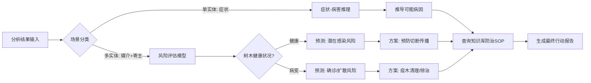

## 1.2 分析用户上传内容

### 1.2.1 设计思路

本系统的核心分析流程旨在将非结构化的图像数据转化为结构化的知识图谱信息。设计分为三个层次：单实体特征分析、多实体关联分析以及动态知识更新。

1.  **单实体分析 (Single Entity Analysis)**
    *   **目标**: 识别图像中的具体对象（如松墨天牛、马尾松病叶），并提取其细粒度特征。
    *   **流程**:
        *   **检测与分类**: 利用深度学习模型定位图像中的感兴趣区域（ROI），输出类别标签（如 `insect`, `tree`）。
        *   **特征提取**: 对识别出的实体进行视觉特征分析（颜色、纹理、形状），例如识别叶片的“黄褐色”或昆虫的“触角长度”。
        *   **知识库匹配**: 将识别出的实体名称及特征映射到知识图谱中。使用语义相似度算法计算当前实体与库中标准实体的距离，判断是“已知实体”还是“未知变体”。
        *   **特征比对**: 将提取的特征与知识库中该实体的“典型特征”进行比对，识别异常（如“叶色”应为“绿色”但检测为“红褐色”）。

2.  **多实体关联分析 (Multi-Entity Relationship Analysis)**
    *   **目标**: 在识别出多个实体（如“天牛”和“松树”）的基础上，验证它们之间的生态或病理关系。
    *   **流程**:
        *   **共现检测**: 统计同一场景下出现的实体组合。
        *   **关系验证**: 查询知识图谱中是否存在连接这两个实体的边（如 `松墨天牛 --[传播]--> 松材线虫`，`松材线虫 --[感染]--> 马尾松`）。
        *   **逻辑校验**: 利用预定义的规则库（如 `MultiEntityAnalyzer` 中的 `validation_combinations`）验证关系的合理性。例如，若检测到“松墨天牛”和“健康的马尾松”，则验证为“潜在风险”关系。

3.  **持续知识更新 (Continuous Knowledge Update)**
    *   **目标**: 构建自进化的知识库，处理识别过程中的“意外”情况。
    *   **机制**:
        *   **低置信度触发**: 当实体识别置信度高但与KB中实体相似度低于阈值（如 0.8）时，标记为“新实体候选”。
        *   **新关系发现**: 当两个已知实体频繁共现但图谱中无直接连边时，推断可能存在隐含关系（如“新媒介”）。
        *   **入库流程**: 自动生成更新建议，经人工或高置信度自动确认后，写入 `knowledge_triples` 表。

### 1.2.2 实现流程

#### 核心算法与模型
*   **图像识别**: 采用 **YOLOv8** (You Only Look Once v8) 模型。
    *   模型选择: `yolov8m.pt` (中型模型) 以平衡推理速度与精度。
    *   训练数据: 包含松材线虫病相关的特定数据集（昆虫、病叶、树干等）。
*   **相似度计算**: 采用 **Word2Vec** 词向量模型。
    *   通过计算词向量余弦相似度，判断识别出的标签（如“褐梗天牛”）与库中实体（“松墨天牛”）的语义距离。
*   **大模型辅助**: 集成 **Kimi API** (Moonshot AI) 处理复杂的长尾实体识别和非结构化描述生成。

#### 处理流程图

```mermaid
graph TD
    A[用户上传图片] --> B{图像预处理}
    B --> C[YOLOv8 目标检测]
    
    C --> D{检测到实体?}
    D -- 否 --> E[返回未检测提示]
    D -- 是 --> F[提取实体列表]
    
    subgraph 单实体分析
    F --> G[特征提取 & 标签映射]
    G --> H[Word2Vec 相似度匹配]
    H --> I{相似度 > 阈值(0.8)?}
    I -- 是 --> J[标记为已知实体]
    I -- 否 --> K[标记为新实体候选]
    end
    
    subgraph 多实体分析
    J --> L{实体数量 >= 2?}
    L -- 是 --> M[查询知识图谱关系]
    M --> N[规则引擎验证组合]
    N --> O[生成关系置信度]
    end
    
    subgraph 知识更新
    K --> P[生成新实体建议]
    O --> Q{关系存在?}
    Q -- 否 --> R[生成新关系建议]
    end
    
    P & R --> S[存入数据库/待审核]
    J & O --> T[返回分析结果]
```

#### 关键代码逻辑 (Python)

*   **实体识别 (`LocalYOLOImageAnalysisService`)**:
    ```python
    # 调用YOLO模型进行推理
    results = self.model(image, conf=0.15, iou=0.45)
    # 映射类别到知识图谱本体
    category = self.category_mapping.get(class_name, "other")
    ```
*   **多实体验证 (`MultiEntityAnalyzer`)**:
    ```python
    # 验证松材线虫病特定的实体组合
    def _validate_pine_disease_combination(self, entities):
        has_vector = any(e['type'] == 'insect' for e in entities)
        has_host = any(e['type'] == 'tree' for e in entities)
        if has_vector and has_host:
            return {"risk_level": "High", "reason": "媒介与寄主共存"}
    ```

---

## 1.3 预测与提供方案

### 1.3.1 设计思路

预测模块是系统的决策大脑，它基于 1.2 节的分析结果，利用知识图谱的推理能力，从“是什么”（识别）推导“会怎样”（预测）和“怎么办”（方案）。

1.  **基于图谱的逻辑推导 (Graph-based Inference)**
    *   **原理**: 利用知识图谱中的三元组路径进行多跳推理。
    *   **路径示例**: `检测到的症状(松针褐变)` -> `关联病害(松材线虫病)` -> `致病因子(松材线虫)` -> `传播媒介(松墨天牛)`。
    *   **推导目标**: 补全图像中不可见的信息（如肉眼不可见的线虫、未来的病变趋势）。

2.  **场景化预测模型 (Scenario-based Prediction)**
    系统根据识别到的实体组合，自动匹配以下典型场景进行预测：
    *   **场景 A: 潜伏期风险预测 (虫在，树未病)**
        *   **输入**: 识别到“松墨天牛” + 健康“马尾松”。
        *   **推理**: 存在传播媒介，且寄主易感。
        *   **预测**: 感染风险等级“高”，预计发病窗口期（基于季节特征）。
        *   **方案**: 预防性措施（如悬挂诱捕器、喷洒化学药剂）。
    *   **场景 B: 确诊治理方案 (虫在/不在，树已病)**
        *   **输入**: 识别到“红褐色松针” + “枯死树干”。
        *   **推理**: 症状符合松材线虫病晚期特征。
        *   **预测**: 树木已不可逆转死亡，存在传染源扩散风险。
        *   **方案**: 应急处置措施（如疫木伐除、熏蒸处理、无害化粉碎）。

3.  **行动指导生成 (Actionable Guidance)**
    *   将推导出的“治理模式”映射为具体的执行步骤。
    *   调用知识库中的“防治方案”节点，提供标准作业程序（SOP）。

### 1.3.2 实现流程

#### 核心方法
*   **三元组匹配**: 使用 Cypher 风格的查询逻辑（在 MySQL 中通过 Join 实现）查找 `(Entity A) -[Relation]-> (Entity B)` 链条。
*   **规则推理引擎**: 基于 `MultiEntityAnalyzer` 中的 `_generate_recommendations` 方法，结合置信度评分生成最终建议。

#### 预测流程图



#### 关键代码逻辑 (Python)

*   **生成建议 (`MultiEntityAnalyzer`)**:
    ```python
    async def _generate_recommendations(self, entities, existing_rels, ...):
        recommendations = []
        # 规则：如果存在媒介昆虫和易感树木
        if self._check_vector_host_risk(entities):
            recommendations.append("建议立即悬挂诱捕器进行种群密度监测")
            recommendations.append("对周边松树进行预防性注干打孔")
        
        # 规则：如果确诊病死树
        if self._check_disease_symptom(entities):
            recommendations.append("标记疫木，安排伐除")
            recommendations.append("伐桩需进行覆膜熏蒸处理")
            
        return recommendations
    ```
